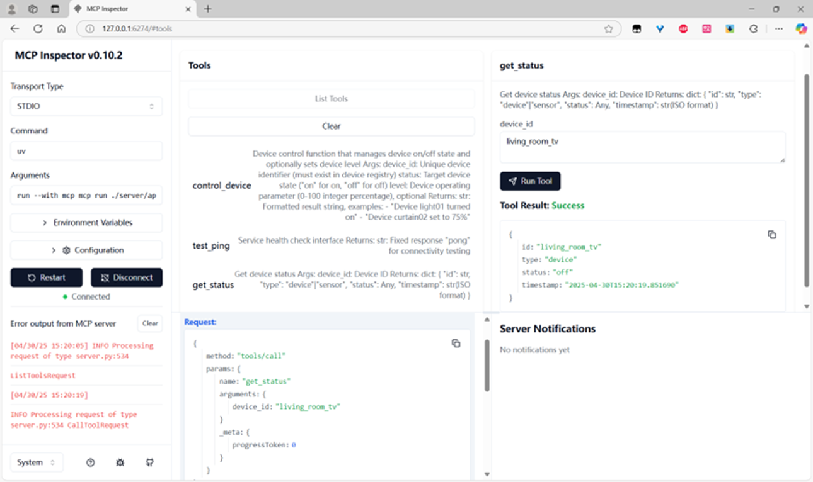
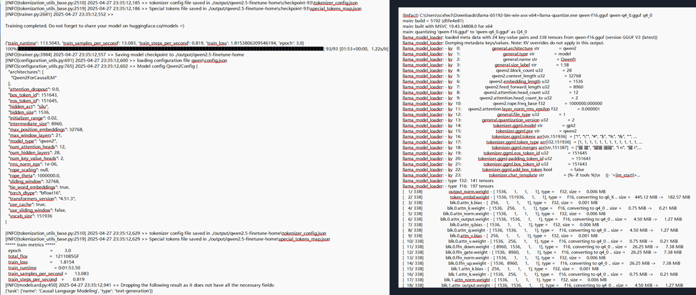

# Smart Home Voice Control System
这是宁诺CS研究生课程作业。

本项目调通了MCP在家居场景下的LLM外部工具调用流程：<br>用户语音<->ASR<->LLM<->MCP Client<->MCP Server<->家电设备

并且微调量化了一个Qwen2.5-1.5B使其能放在弱算力的树莓派4B上运行

简历中的描述如下：
<br>智能家居语音控制Agent- 个人独立
2025-04 ~ 2025-04
1. 基于树莓派 4B，实现了支持语音交互的家电控制 Agent，涵盖 MCP 、LLM 监督微调、ASR/TTS 和模型量化部署
2. 利用MCP官方Python SDK，在Server端实现了外部工具调用，在Client端用LangChain加载模型、构建提示词工程
3. 调用 DeepSeek API 生成1000条ShareGPT 格式对话，数据清洗，置入MCP流程验证有效性
4. 利用Llama-Factory对Qwen2.5‑1.5B模型进行指令微调，合并LoRA，再用llama.cpp将safetensor转为gguf并做4-bit量化
5. 在对话流程中嵌入Whisper ASR和pyttsx3 TTS，实现全程语音问答

<br>流程图
![\[!image.png\]](imgs/image.png)
<br>架构图

<br>MCP调试工具

<br>微调和量化


A Python-based smart home simulation system that allows voice control of home appliances through either online API or local LLM.
Github: https://github.com/1478387600/SmartHome/tree/simulation

## Features
- Simulates various home appliances (lights, AC, TV, etc.)
- Voice control
- Supports both online API and local LLM modes

## Prerequisites
- Python 3.10+
- Windows

## Installation & Setup

1. cd to this repository:
```bash
cd path/to/this/project
```

2. Create and activate a virtual environment (recommended):

Using Python's built-in venv:
```bash
python -m venv venv
source venv/bin/activate  # On Windows use `venv\Scripts\activate`
```

Or using uv (faster alternative):
```bash
uv venv venv
source venv/bin/activate  # On Windows use `venv\Scripts\activate`
```

3. Install dependencies:

Using pip:
```bash
pip install -r requirements.txt
```

Or using uv (faster alternative):
```bash
uv pip install -r requirements.txt
```

## Running the Application

1. Run the main.py file in the root path of the project
2. Check the "Home Appliance Simulation" check box
3. Click "Run"
4. In the next window:
   - Click "Online API" to use cloud-based voice recognition
   - OR click "Local LLM" to use local language model
5. Focus on the terminal in your IDE (the software where the code is running) to interact with the system

## Project Structure
```
SmartHome/
├── client/               # Client-side implementation
│   ├── core/             # Core client functionality
│   ├── llm/              # Language model integrations
│   ├── runners/          # Application runners
│   ├── speech/           # Speech recognition and synthesis
│   └── strategies/       # Different LLM strategy implementations
│
├── environment/          # Home simulation environment
│   ├── images/           # Appliance images for GUI
│   └── *.py              # Simulation and visualization scripts
│
├── model/                # Device and sensor models
│   ├── base/             # Base classes
│   ├── devices/          # Specific appliance implementations
│   ├── Manager/          # Management classes
│   └── sensors/          # Sensor implementations
│
├── server/               # Backend server implementation
│   └── resources/        # Configuration files
│
├── main.py               # Main application entry point
├── requirements.txt      # Python dependencies
└── README.md            # Project documentation
```

## Troubleshooting
- If you encounter missing dependencies, run `pip install -r requirements.txt` again
- If you encounter a collision related to the version of dependancies, remove the version and leave just the name of library in the requirements.txt 
- For voice recognition issues, check your microphone settings
- Ensure you have stable internet connection when using Online API mode
- If you found that the MCP client could not be launch, try to run server/app.py in another terminal session manually first.
- I also encounter the problem that the tts is speaking but the computer doesn't make a sound from time to time, that's because bad luck.
- If you want to try the local LLM, please download the file on the huggingface (by searching "vlmbgnr/qwen2.5-1.5b-instruct-smarthome-lora-gguf-q4_o"), link = https://huggingface.co/vlmbgnr/qwen2.5-1.5b-instruct-smarthome-lora-gguf-q4_o/tree/main. Download it and put to project_folder\client\llm\models\qwen-q4_0.gguf and modify the MODEL_FILE in client\llm\config.py to make sure the path is correct.
- Strongly recommand to the API solution. There is an API key in the ".env" file, don't share it out.
## Contributors
All code files except those in the folder "environment": HengyuanWU_20717357
Simulator related files: NattapongNEADTIP_20717335
